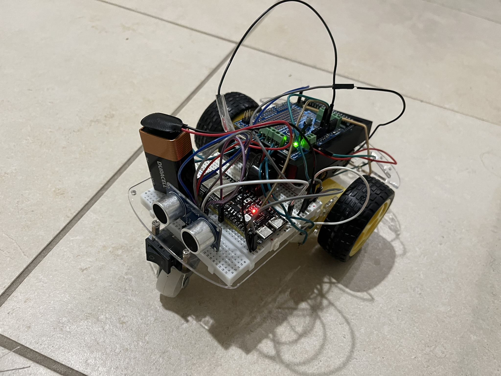

# Obstacle Avoiding RC Rover

[](https://www.arduino.cc/)
[](https://en.wikipedia.org/wiki/C%2B%2B)
[](https://www.espressif.com/)
[](https://www.freertos.org/)
[](https://docs.espressif.com/projects/esp-idf/en/latest/esp32/api-reference/network/esp_now.html)
[]()
[]()

A fully autonomous, Wi-Fi controlled RC rover built as the final project for **CSE 474 - Embedded Systems** at the University of Washington, taught by **Professor John Raiti**.

This project implements an intelligent RC rover that combines wireless remote control with autonomous obstacle avoidance. The system uses a dual-processor architecture with an ESP32-S3 handling high-level control and wireless communication, while an Arduino Mega manages motor control through an Adafruit Motor Shield.

**The Finished Product:**


## Features

- **Dual-Microcontroller Architecture**: ESP32-S3 for intelligence/wireless, Arduino Mega for motor control
- **Wireless Remote Control**: ESP-NOW protocol for low-latency command transmission
- **Autonomous Obstacle Avoidance**: Ultrasonic sensor with safety logic that overrides manual commands
- **Progressive Speed Control**: PWM-based motor speed regulation with smooth acceleration
- **Audio Feedback**: Audible alarm when obstacles are critically close

## System Architecture

```
┌─────────────────┐     ESP-NOW      ┌──────────────────┐
│   Remote        │ ──────────────── │  ESP32-S3        │
│   Controller    │                  │  (Master)        │
│   (ESP32-S3)    │                  │                  │
└─────────────────┘                  │  - Ultrasonic    │
                                     │    Sensor        │
                                     │  - Decision      │
                                     │    Logic         │
                                     └────────┬─────────┘
                                              │ Serial
                                              │ (UART)
                                     ┌────────▼─────────┐
                                     │  Arduino Mega    │
                                     │  (Motor Driver)  │
                                     │                  │
                                     │  - Motor Shield  │
                                     │  - DC Motors     │
                                     └──────────────────┘
```

## Hardware Components

| Component | Description |
|-----------|-------------|
| ESP32-S3 (x2) | Main processor and remote controller |
| Arduino Mega 2560 | Motor control interface |
| Adafruit Motor Shield V2 | Dual H-bridge motor driver |
| HC-SR04 Ultrasonic Sensor | Distance measurement |
| Buzzer/Alarm | Proximity warning indicator |
| DC Motors (x2) | Rover drive wheels |
| LIPO Battery | Power supply |

## Project Structure

```
Obstacle_Avoiding_RC_Rover/
├── Arduino_Mega/
│   ├── mega_motor_driver/       # Main motor control firmware
│   └── hardware_test/           # IR transmitter driver tests
├── ESP32/
│   ├── esp32_master/            # Rover master controller firmware
│   └── hardware_tests/          # IR reader/transmitter tests
├── Remote_Control/
│   └── Remote_Control.ino       # Handheld controller firmware
├── Tests/
│   └── motor_test/              # Motor driver validation
├── mac_address_test/            # ESP-NOW peer MAC address utility
├── LICENSE
└── README.md
```

## Firmware Description

### ESP32 Master Controller (`ESP32/esp32_master/`)

The rover's central intelligence running FreeRTOS with two concurrent tasks:

- **Sensor Task**: Continuously reads the ultrasonic sensor and updates distance measurements
- **Decision Task**: Evaluates proximity data and remote commands to determine safe motion

**Safety Logic:**
- Critical threshold (8 cm): Immediate stop and backtrack
- Obstacle threshold (20 cm): Caution mode with reduced forward speed

### Arduino Motor Driver (`Arduino_Mega/mega_motor_driver/`)

Receives motion commands over Serial1 and controls motors through the Adafruit Motor Shield:

| Command | Action |
|---------|--------|
| `FORWARD` | Both motors run forward |
| `BACKWARD` | Both motors run backward |
| `LEFT` | Left motor reverses, right motor forward |
| `RIGHT` | Left motor forward, right motor reverses |
| `STOP` | Release both motors |

### Remote Controller (`Remote_Control/`)

Handheld ESP32 controller with three buttons:

| Button(s) | Command |
|-----------|---------|
| Left | Turn left |
| Right | Turn right |
| Left + Right | Forward |
| Back | Reverse (highest priority) |
| None | Stop |

Commands are transmitted over ESP-NOW at 25 Hz for responsive control.

## Building and Flashing

### Prerequisites

- Arduino IDE 2.0+ or PlatformIO
- ESP32 board support (esp32 by Espressif)
- Required libraries:
  - `esp_now.h` (included with ESP32 core)
  - `NewPing.h` for ultrasonic sensors
  - `Adafruit_MotorShield.h` for motor control
  - `WiFi.h` (included with ESP32 core)

### Flashing Instructions

1. **ESP32 Master (Rover)**
   - Open `ESP32/esp32_master/esp32_master.ino` in Arduino IDE
   - Select "ESP32S3 Dev Module" board
   - Flash to rover's ESP32-S3

2. **Arduino Mega (Motor Driver)**
   - Open `Arduino_Mega/mega_motor_driver/mega_motor_driver.ino`
   - Select "Arduino Mega 2560" board
   - Flash to Arduino Mega

3. **Remote Controller**
   - Open `Remote_Control/Remote_Control.ino`
   - Select appropriate ESP32 board variant
   - Flash to controller ESP32-S3

### Wiring Diagram

**ESP32 Master → Arduino Mega:**
- ESP32 TX (GPIO 2) → Mega RX1 (Pin 19)
- ESP32 RX (GPIO 16) → Mega TX1 (Pin 18)
- GND → GND (common ground)

**Ultrasonic Sensor (HC-SR04):**
- TRIG → ESP32 GPIO 5
- ECHO → ESP32 GPIO 18
- VCC → 5V
- GND → GND

**Motor Shield Connections:**
- Motors connected to M1 (left) and M2 (right)
- Shield powered from external 12V supply


## ESP-NOW Configuration

Before use, obtain the MAC addresses of both ESP32 devices:

```cpp
// Run mac_address_test.ino on each device
Serial.println(WiFi.macAddress());
```

Update the peer's MAC address in `Remote_Control.ino`:
```cpp
uint8_t carPeerMac[] = { 0xB8, 0xF8, 0x62, 0xE0, 0x84, 0x2C };
```

## Testing

The project includes hardware test files for validating individual components:

- `Tests/motor_test/` - Motor direction and speed control validation
- `ESP32/hardware_tests/ir_reader_test/` - IR receiver decoding
- `ESP32/hardware_tests/ir_transmitter_test/` - IR LED transmission
- `mac_address_test/` - MAC address discovery utility

## Course Information

- **Course**: CSE 474 - Introduction to Embedded Systems
- **Instructor**: Professor John Raiti
- **Institution**: University of Washington

## Authors

- **Aaryan Pawar**
- **Asaf Iron-Jobes**

## License

This project is licensed under the MIT License - see the [LICENSE](LICENSE) file for details.

## Technical Notes

### Timing Characteristics

| Parameter | Value |
|-----------|-------|
| ESP-NOW command rate | 25 Hz (40 ms interval) |
| Sensor sampling rate | 10 Hz (100 ms interval) |
| Alarm toggle rate | 5 Hz (200 ms on/off) |
| Serial baud rate | 9600 baud |

### Thread Safety

The ESP32 master uses FreeRTOS mutexes to protect shared state between tasks:
- `distanceMutex` - Protects `measuredDistanceCm`
- `commandMutex` - Protects `remoteCommand`

### Power Considerations

- Motor Shield requires 7-12V external power supply
- ESP32 modules powered via USB or 5V regulator
- Avoid powering motors from Arduino 5V rail
